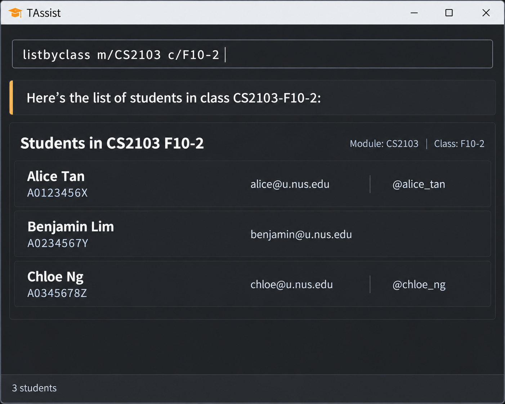

# TAssist

TAssist is a desktop application for teaching assistants who manage
students across multiple modules and tutorial classes.

It is optimised for teaching assistants who prefer fast keyboard-based
commands while retaining the benefits of a graphical interface.

## Features

- Add, find, list and remove student records
- Store student numbers, names, email addresses and Telegram usernames
- Create, list and remove module classes
- Assign and unassign students from classes
- List students assigned to a class
- Save successful changes automatically

## Documentation

- [User Guide](https://ay2627s1-cs2103-f10-2.github.io/tp/UserGuide.html)
- [Developer Guide](https://ay2627s1-cs2103-f10-2.github.io/tp/DeveloperGuide.html)

## Acknowledgements

This project is based on the AddressBook-Level3 project created by the
[SE-EDU initiative](https://se-education.org).
