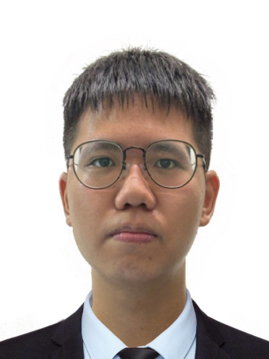
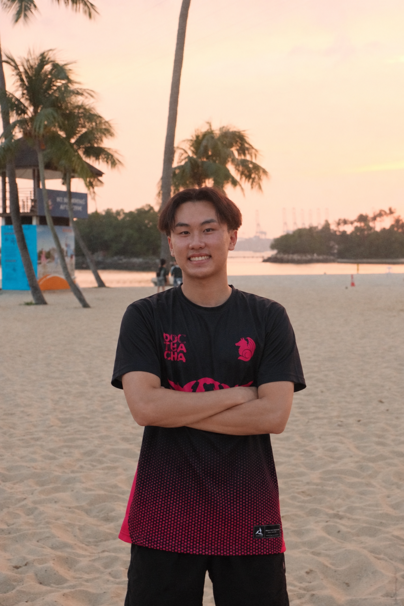

# About Us

We are a team based in the [School of Computing, National University of Singapore](http://www.comp.nus.edu.sg).

You can reach us at the email `seer[at]comp.nus.edu.sg`

## Project team

### Lee Wen Kang

[[homepage](https://wenkang.dev/)]
[[github](https://github.com/LeeWenKang-NUS)]

<!-- [[portfolio](team/johndoe.md)] -->

- Role: Tech Lead

### Jane Doe

[[github](http://github.com/johndoe)]
[[portfolio](team/johndoe.md)]

* Role: Team Lead
* Responsibilities: UI

### Johnny Doe

[[github](http://github.com/johndoe)] [[portfolio](team/johndoe.md)]

* Role: Developer
* Responsibilities: Data

### Jean Doe

[[github](http://github.com/johndoe)]
[[portfolio](team/johndoe.md)]

* Role: Developer
* Responsibilities: Dev Ops + Threading

### Bevan Poh

[[github](https://github.com/bevanpoh)]

* Role: Developer
* Responsibilities: UI

### Ryan Yong

[[github](https://github.com/ryanyzh)]

* Role: Tester
* Responsibilities: Plans tests, checks features, manages bug reports and regression testing
